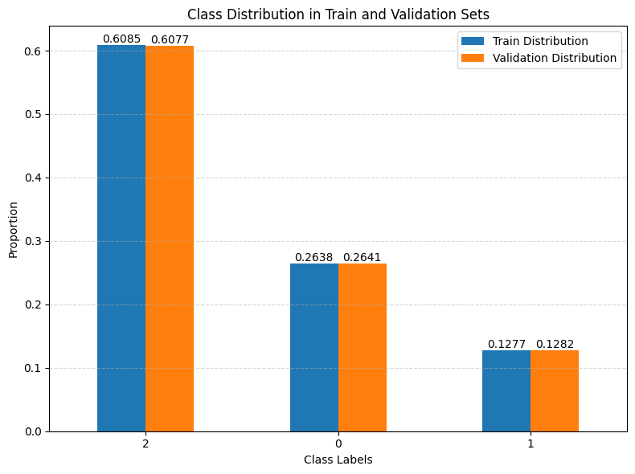
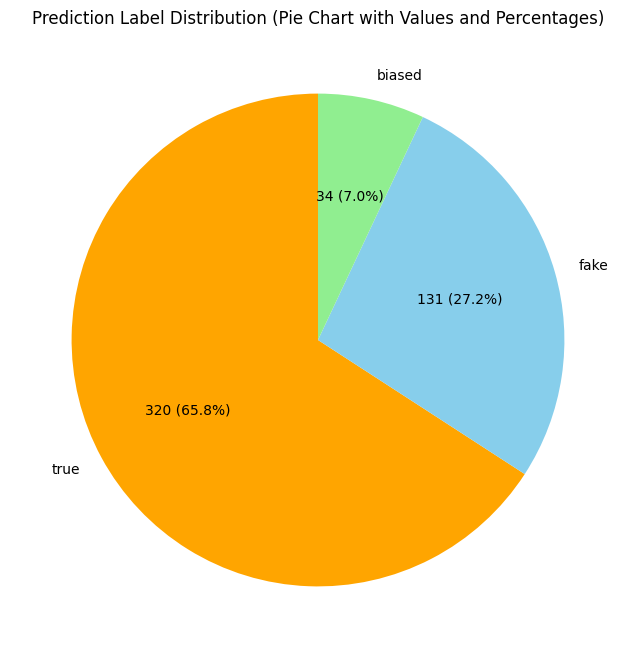

# Fake News Detection using CamemBERT

## Introduction
This project addresses the problem of fake news detection about climate change using **CamemBERT**, a BERT variant optimized for the French language. The model was trained on a manually annotated dataset containing three classes:
- `fake`
- `biased`
- `true`

The dataset was split into:
- **Training set**: Used for training the model.
- **Validation set**: Used for performance evaluation during training.

---

## Methodology

### 1. Data Preparation
The dataset was divided into training (80%) and validation (20%) subsets using `train_test_split` from `sklearn`. The `stratify` parameter was applied to ensure class distribution consistency between the two sets. Labels were mapped numerically as follows:
- `fake` → 0
- `biased` → 1
- `true` → 2

A custom class, `NewsDataset`, was implemented using `torch.utils.data.Dataset` to handle data loading, returning:
- `input_ids`: Token IDs from the tokenizer.
- `attention_mask`: Mask indicating real tokens vs. padding.
- `labels`: Numerical labels for news items.

### 2. Text Tokenization
The **CamemBERT** tokenizer ("camembert-base") was used to preprocess the text with the following steps:
- **Padding**: Ensures sequences have the same length.
- **Truncation**: Limits sequences to a maximum of 512 tokens.
- **Tensor Conversion**: Converts tokens into PyTorch tensors.

### 3. Training Configuration
The training process was configured with `TrainingArguments` from `transformers`:
- **Epochs**: 10
- **Learning rate**: 2e-5
- **Batch size**: 8 for both training and validation.
- **Evaluation strategy**: Evaluated at the end of each epoch.
- **Model saving**: Best model saved based on validation accuracy.

### 4. Metric Calculation
A `compute_metrics` function was defined to calculate:
- **Accuracy**: Proportion of correctly classified samples.
- **Classification Report**: Precision, recall, and F1-score for each class.

### 5. Training
Training was conducted using the `Trainer` class from `transformers`, which automates training, evaluation, and optimization. The trained model and tokenizer were saved for reuse.

---

## Results
The model’s performance across 10 epochs is summarized below:

| Epoch | Training Loss | Validation Loss | Accuracy  |
|-------|---------------|-----------------|-----------|
| 1     | 0.573800      | 0.589476        | 0.771795  |
| 2     | 0.513400      | 0.632872        | 0.774359  |
| 3     | 0.423000      | 0.734434        | 0.756410  |
| 4     | 0.473800      | 0.815394        | 0.769231  |
| 5     | 0.184700      | 0.754072        | 0.802564  |
| 6     | 0.110900      | 0.885092        | 0.764103  |
| 7     | 0.094000      | 0.910120        | 0.782051  |
| 8     | 0.105100      | 0.980540        | 0.779487  |
| 9     | 0.011300      | 1.024335        | 0.776923  |
| 10    | 0.158600      | 1.035487        | 0.774359  |

The highest accuracy (0.802564) was achieved in epoch 5, which was selected as the final model.

### Prediction Distribution
The distribution of predictions on the test set was as follows:
- **True**: 320 (65.8%)
- **Fake**: 131 (27.2%)
- **Biased**: 34 (7.0%)

